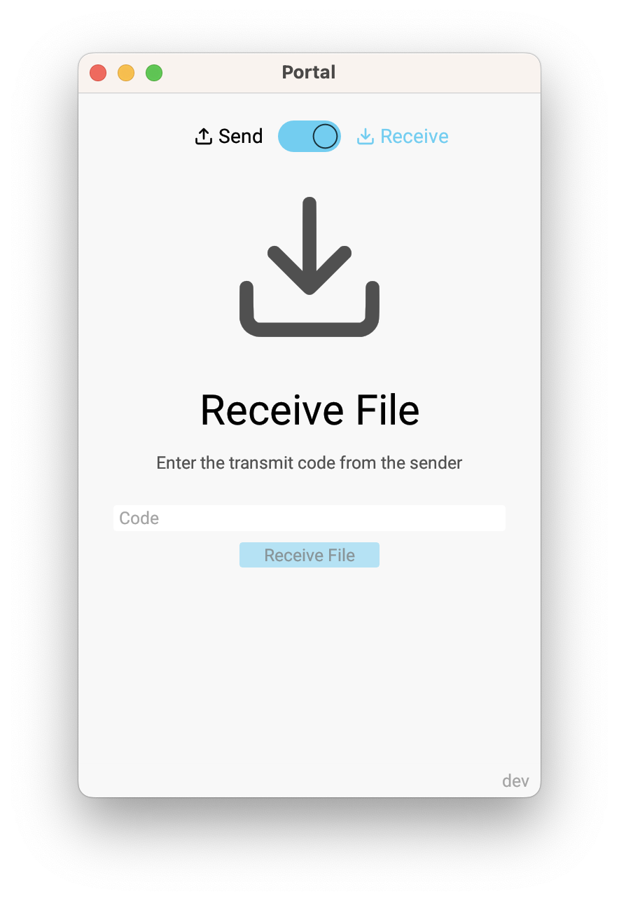
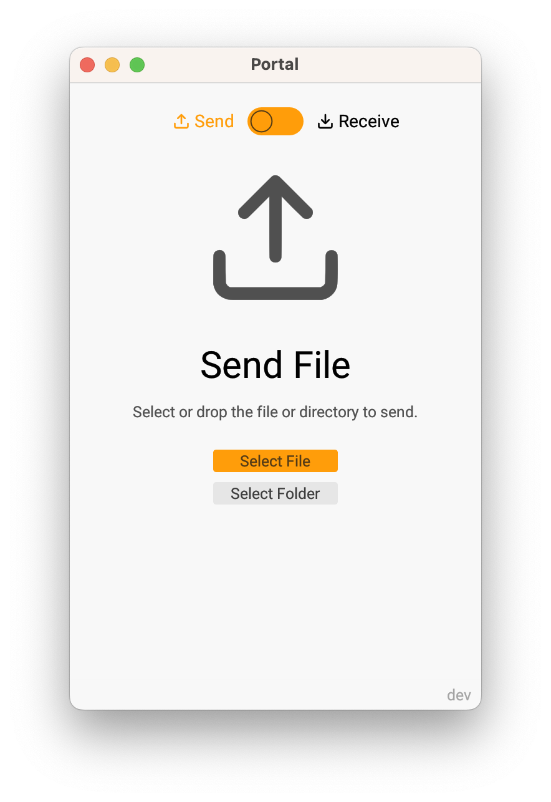

# Portal

A cross-platform GUI for [Magic Wormhole](https://github.com/magic-wormhole/magic-wormhole)
implemented using the amazing [egui](https://www.egui.rs/) library.

## Installation

Head over to [Releases](https://github.com/bash/portal/releases/latest)
to download pre-built executables (there's even a Windows installer).

## Screenshots

<picture>
  <source media="(prefers-color-scheme: dark)" srcset="screenshots/receive-dark.png">
  <source media="(prefers-color-scheme: light)" srcset="screenshots/receive-light.png">
  
</picture>
<picture>
  <source media="(prefers-color-scheme: dark)" srcset="screenshots/send-dark.png">
  <source media="(prefers-color-scheme: light)" srcset="screenshots/send-light.png">
  
</picture>

## License

Licensed under either of

* Apache License, Version 2.0
  ([license-apache.txt](license-apache.txt) or http://www.apache.org/licenses/LICENSE-2.0)
* MIT license
  ([license-mit.txt](license-mit.txt) or http://opensource.org/licenses/MIT)

at your option.

## Contribution

Unless you explicitly state otherwise, any contribution intentionally submitted
for inclusion in the work by you, as defined in the Apache-2.0 license, shall be
dual licensed as above, without any additional terms or conditions.
